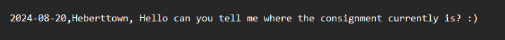
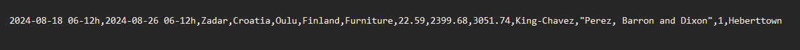
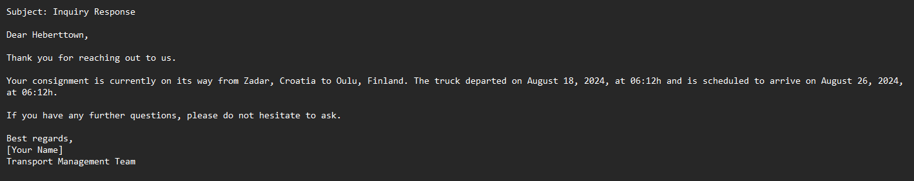

# AI Assistant Mail Inquiries

This project is about an AI assistant which can serve as the core of an application for a transportation forwarding company for intelligently answering self-reliantly mail inquiries about the current location of shipments.

The core of this project is the _main.py_ file which contains the OpenAI API. This API accesses a list of incoming mail inquiries (simulated with synthetic data contained in _inquiries.csv_) and then retrieves the respective data needed to give information from a database (simulated with synthetic data in _shipments.csv_). With the _prompts.py_ file a comprehensive prompt is formulated which gives the model all instructions and data it needs. The resulting output is saved into a txt file.

Project content:

- _main.py_
- _prompts.py_
- _inquiries.csv_
- _shipments.csv_
- _inquiry_answer.txt_
- _requirements.txt_

## Getting started

To set up this repo create a folder for the project on your system (instructions for windows), open a terminal window, write "cd" and paste the folder path `cd "C:\Users\user\path\to\your\folder"`. Then type `git clone https://github.com/Yesitin/AI-work-colleague.git` to download the whole repository (ensure that you have installed python and git). 

Next, create a virtual environment in order to avoid dependency conflicts. For this, type into the terminal `python -m venv env`. With `env\Scripts\activate` you start the environment.

Now you can install all dependencies with `pip install -r requirements.txt`. 

As a last step, you have to create a .env file and insert and OpenAI key: `OPENAI_API_KEY=your_api_key`. Replace _your_api_key_ with your actual key. Finally, run _main.py_ or adjust _inquieries.csv_ and _shipments.csv_

## Example

In this example the sender "Heberttown" asks for the location of his consignment:

Now, the Agent can look in the order table which shipment belongs to "Heberttown":

Finally, Agent creates a professional info mail to "Heberttown": 

